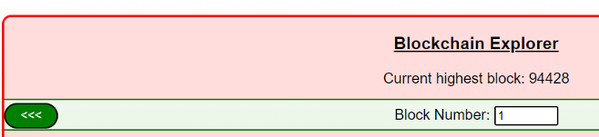
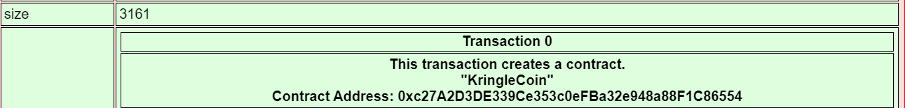

# Blockchain Divination


Use the Blockchain Explorer in the Burning Ring of Fire to investigate the contracts and transactions on the chain. At what address is the KringleCoin smart contract deployed? Find hints for this objective hidden throughout the tunnels.

### Challenge
:::info Challenge Text
*Difficulty:* ★★★★✰

Use the Blockchain Explorer in the Burning Ring of Fire to investigate the contracts and transactions on the chain. At what address is the KringleCoin smart contract deployed? Find hints for this objective hidden throughout the tunnels.
:::

### Answer

<details>
<summary>Answer: <code>0xc27A2D3DE339Ce353c0eFBa32e948a88F1C86554</code></summary>

The ```smart contract address``` should be listed at the block where the KringleCoin contract was created, which would be block 1. So we can change the block number to 1 in the explorer and refresh. 



Next, if we scroll down we can see the ```Contract Address: 0xc27A2D3DE339Ce353c0eFBa32e948a88F1C86554``` needed to answer the blockchain divination question.



</details>


