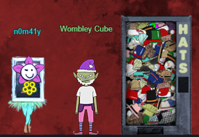
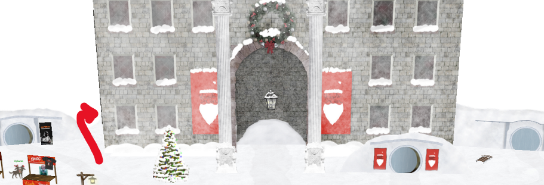
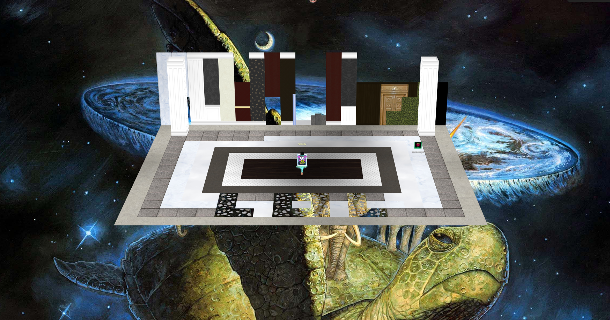
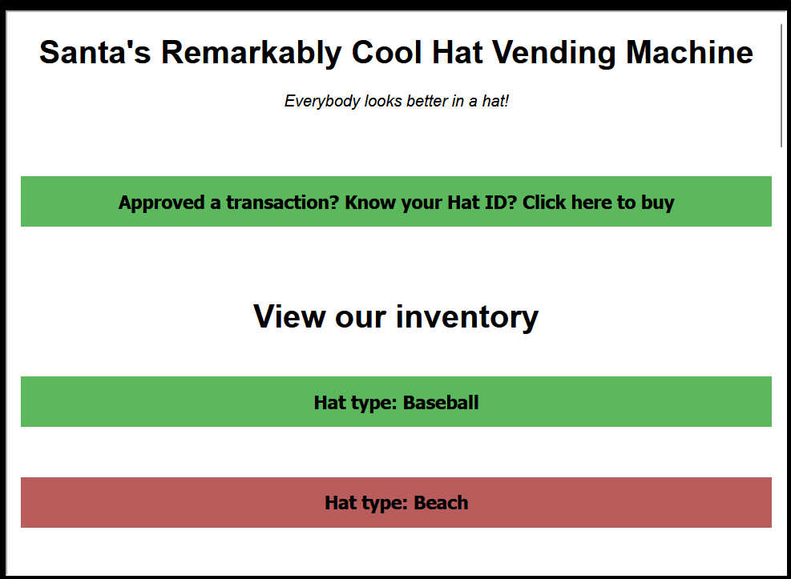
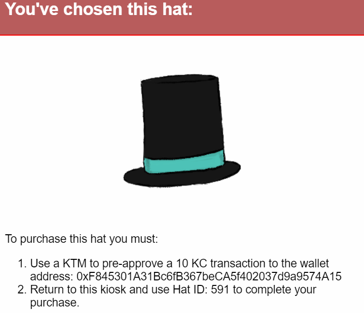
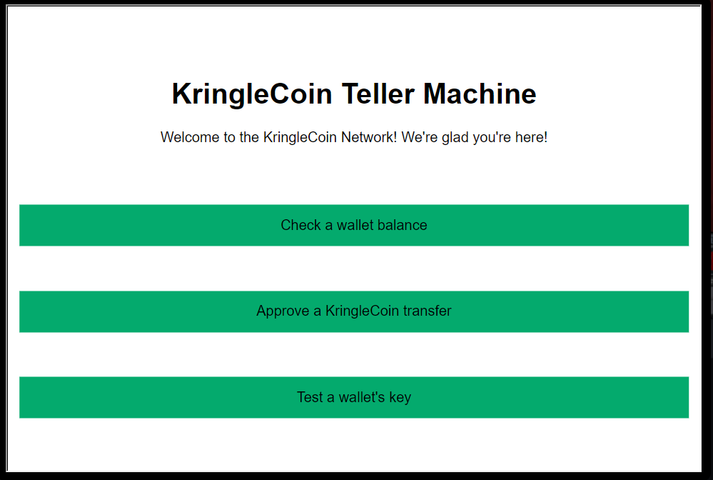
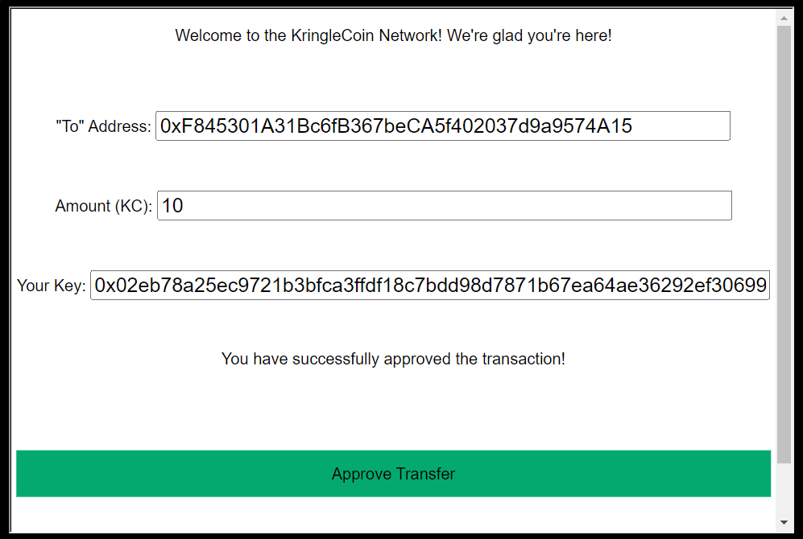
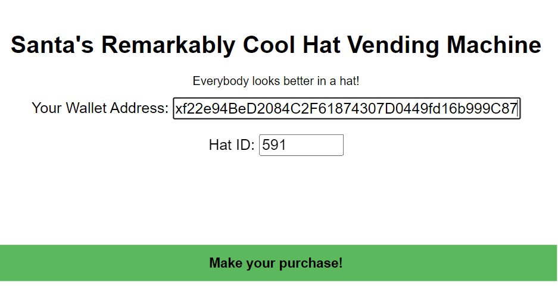
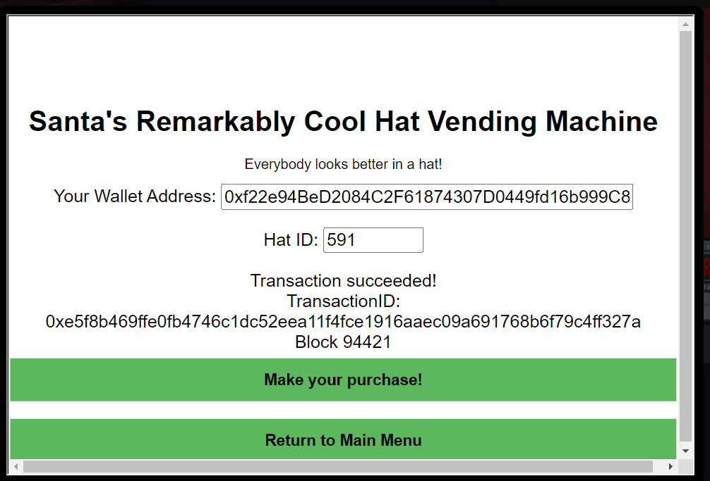
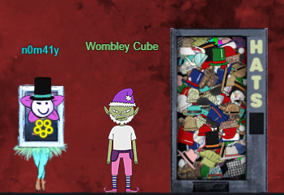

# Buy a Hat

Everybody looks better in a hat!

### Hat Purchasing FAQs

<details>
<summary>Where do I go to purchase a hat?</summary>

To buy a hat we head over to the ```HATS``` vending machine and speak with ```Wombley Cube``` at the entrance to the ```BURNING RING OF FIRE```



</details>

<details>
<summary>What do I bring?</summary>

Cold hard...Kringle Coin. And your wallet key, don't forget that.

</details>

<details>
<summary>How do I find these Coins of Kringle?</summary>

Go on a treasure hunt!!!  You can check out our [super secret guide](/docs/hhc2022/secrets) on where to find some hidden chests that are rumored to have an abundance of kringle coins.
</details>

<details>
<summary>What if I'm a cotton headed ninny muggins that doesn't remember their wallet key???</summary>

We got you fam. You can use some santa magic to retrieve you key if you use the super secret santa magic terminal in a super secret location. 

on the left side of the main hall walk all the way back and then turn right to go behind the building and into the secret room with the lol floor and space turtle dude.


Once you are in the super secret LOL room you can click on the santa magic terminal to regain your lost wallet key!

</details>


### Making the Purchase

Once we're at the vending machine we can view the inventory and pick out our perfect dome topper.



When we click on the hat we see a pop-up with some important information for purchasing the selected hat.



Next we head over to the closest KTM and click ```Approve a KringleCoin transfer``` to pre-approve our hat purchase. 




We have our hat vendor's wallet address ```0xF845301A31Bc6fB367beCA5f402037d9a9574A15```, our wallet key, and we know the cost of our hat ```10 KC```...and if we forgot our wallet key we know where to find some "santa magic" to remember it (see FAQs section above).



Now that we have pre-approved our purchase at the KTM we can head over to the HATS vending machine to make our purchase!

We click the ```Approved a transaction? Know your Hat ID? Click here to buy``` button and fill out the form with our ```wallet address: 0xf22e94BeD2084C2F61874307D0449fd16b999C87``` and the ```Hat ID: 591```



After we click the ```Make your purchase!``` button we get the following confirmation screen to let us know that we have successfully purchased a sweet hat.



To put your hat on just click ```hats``` in your badge menu and voila...


