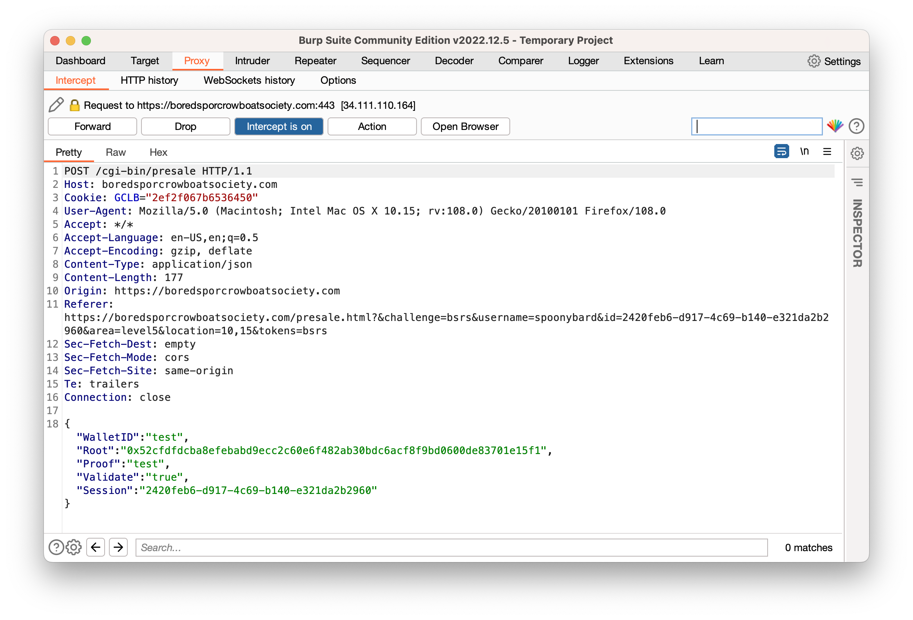
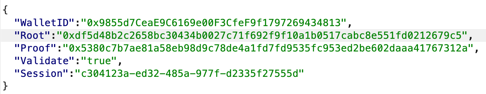
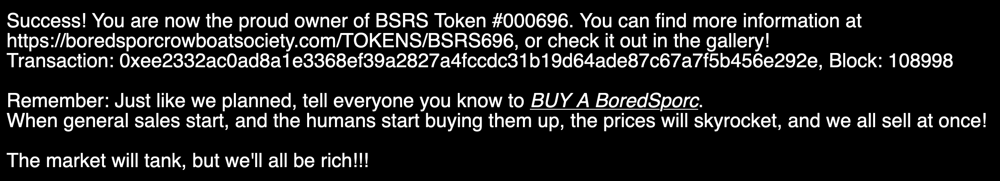

# Exploit a Smart Contract

### Background
A Sporc named Luigi has used the blockchain that hosts KringleCoin to develop his own very above-board NFT collection called the [Bored Ape Yacht](https://en.wikipedia.org/wiki/Bored_Ape)... I mean the Bored Sporc Rowboat Society (BSRS). We absolutely need to get in before the project gets rug pulled, but unfortunately our wallet isn't on the pre-sale list. Maybe we can find a way to trick the system.


### Challenge
:::info Challenge Text
*Difficulty:* ★★★★★

Exploit flaws in a smart contract to buy yourself a Bored Sporc NFT. Find hints for this objective hidden throughout the tunnels.
:::

### Answer

Using the [KringleCoin block chain explorer](https://prod-blockbrowser.kringle.co.in/), we can find the block that creates the BSRS smart contract: block 2. The function which performs the pre-sale mint seems interesting:

```
    function presale_mint(address to, bytes32 _root, bytes32[] memory _proof) public virtual {
        bool _preSaleIsActive = preSaleIsActive;
        require(_preSaleIsActive, "Presale is not currently active.");
        bytes32 leaf = keccak256(abi.encodePacked(to));
        require(verify(leaf, _root, _proof), "You are not on our pre-sale allow list!");
        _mint(to, _tokenIdTracker.current());
        _tokenIdTracker.increment();        
    }
```

This function calls a function named ```verify()``` in order to determine if a recipient is allowed to mint the token. Let's take a look at that too.

```
    function verify(bytes32 leaf, bytes32 _root, bytes32[] memory proof) public view returns (bool) {
        bytes32 computedHash = leaf;
        for (uint i = 0; i < proof.length; i++) {
          bytes32 proofElement = proof[i];
          if (computedHash <= proofElement) {
            computedHash = keccak256(abi.encodePacked(computedHash, proofElement));
          } else {
            computedHash = keccak256(abi.encodePacked(proofElement, computedHash));
          }
        }
        return computedHash == _root;
    }
```

In order to really explain what is happening, it's important to understand a data structure called a [Merkle tree](https://en.wikipedia.org/wiki/Merkle_tree). Expand the section below if you want a full primer on the subject.

<details>
    <summary>
    Merkle Tree Primer
    </summary>

A Merkle tree is a tree data structure where every leaf node contains a cryptographic hash (since we're using Ethereum here, a [Keccak hash](https://deeprnd.medium.com/keccak-hashing-algorithm-sha-3-827896e49913) in this case). Moving up the tree, every non-leaf node contains a cryptographic hash of the nodes below it. This process continues until we reach the very top (or bottom, for the Australians) of the tree. At this point, we will have one hash which is a combination of all of the other hashes in the tree. This is referred to as the **root hash**.

Given some hashing function (```hash()``` in this case), a simple Merkle tree consisting of four hashes would look like the following:

```
0----------------------------------------------------0
|                        Root                        |
| hash(hash(hash_1 + hash_2) + hash(hash_3 + hash4)) |
0----------------------------------------------------0
            |                               |
0-----------------------0       0-----------------------0
| hash(hash_1 + hash_2) |       | hash(hash_3 + hash_4) |
0-----------------------0       0-----------------------0
     |           |                  |               |
0--------0   0--------0         0--------0      0--------0
| hash_1 |   | hash_2 |         | hash_3 |      | hash_4 |
0--------0   0--------0         0--------0      0--------0
```

The advantage of a Merkle tree becomes clear if I want to prove a given hash input was part of the original list of leaf nodes. Because of the way the tree is architected, I can do this with only a small handful of values and *not* the entirety of the tree. For instance, if I want to prove that hash_3 was part of the original hashed set, then the only values I would need are ```hash_4```, ```hash(hash_1 + hash2)```. These two values are then known as my **proof values**. If I were to hash my initial value of hash_3 together with them in proper order, I should be able to perfectly recreate the root hash of the tree.

This feature is very useful as the Merkle tree grows larger, since the amount of proof values I would require only increases logarithmically with the size of the tree: as Professor Query Petabyte mentions:

> A proof containing 32 integers would be sufficient for a Merkle Tree with 4,294,967,296 leaf nodes!

Speaking of Professor Query Petabyte, he's provided us with an [extremely helpful repository](https://github.com/QPetabyte/Merkle_Trees) that explains all of this in more detail and also has a Python script that lets us compute proof values and root of a Merkle tree out of the box. It can even give us the root and proof values of a Merkle tree with just one leaf hash! Although, we shouldn't something that basic... right?

Another interesting quality of Merkle trees (which unfortunately makes our jobs harder here) is that the proof values provided to a user do not provide any other information about the data the tree was originally created from.

</details>

To put it briefly, since blockchain storage is expensive, Luigi has elected to use a Merkle Tree and distribute proof values to his Sporc buddies in order to avoid storing every possible pre-sale eligible wallet.

However, in the Query Petabyte repo I linked earlier, we're given a somewhat incognito hint amongst the rest of the information:

> Of course, the root mustn't be able to be altered, which is why keeping it IN the smart contract on the blockchain is what smart developers do.

This is very true: if we were able to modify the root hash somehow, then the integrity of the entire Merkle tree would be null and void. Despite this, searching through the rest of the Solidity source code that establishes the BSRS smart contract reveals no hard coded root hash, nor any references to one somewhere else on the blockchain, even though the ```verify()``` function accepts it as an argument. If we attempt to buy a BSRS NFT from the terminal and analyze the web traffic, it becomes clear what's happening: the root hash is stored and handled by the BSRS website.


Sticking in ```test``` for both the proof and wallet address on the purchase page makes us send the following request:



We can pretty confidently say that this ```Root``` argument here is the root hash of the Merkle tree, and since we're in control of this request, we're in control of the validity of the entire tree! Using the Professor's Python script, we can substitute our wallet address ```0x9855d7CeaE9C6169e00F3CfeF9f1797269434813``` (along with the null address so we get at least one proof value) into the program's allow list and run it to get our root hash and proof value:

```python
allowlist = ['0x9855d7CeaE9C6169e00F3CfeF9f1797269434813','0x0000000000000000000000000000000000000000']
```

```
devan@daedalus (/Users/devan/Merkle_Trees) $ ./merkle_tree.py 
Root: 0xdf5d48b2c2658bc30434b0027c71f692f9f10a1b0517cabc8e551fd0212679c5
Proof: ['0x5380c7b7ae81a58eb98d9c78de4a1fd7fd9535fc953ed2be602daaa41767312a']
```

Now, we can intercept the traffic, edit in our values (making sure to overwrite the original root value) and send it through to be told what we already know 😎




Finally, we can authorize a transaction of 100 KC to the BSRS wallet address of ```0xe8fC6f6a76BE243122E3d01A1c544F87f1264d3a```. Once we send the transaction through again with the ```Validate``` argument set to ```false```, we're now the proud owner of a BSRS NFT!



Isn't it lovely? (pls do not screenshot I will sue)


