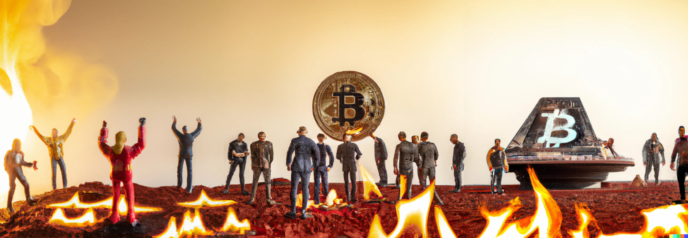

# The Burning Ring of Fire

## Outline

The quest for our final ring brings us to... hell, I guess? Seems like a fitting place to hold an NFT sale to me. These challenges all focus on cryptocurrency, specifically KringleCoin, this convention's party favor. All of these challenges are very informative and interesting for someone who has had little interaction with cryptocurrency before.

## Challenges

* [Buy a Hat ★★☆☆☆](./buy_a_hat.md)
* [Blockchain Divination ★★★★☆](./blockchain_divination.md)
* [Exploit a Smart Contract ★★★★★](./exploit_a_smart_contract.md)
