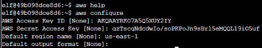
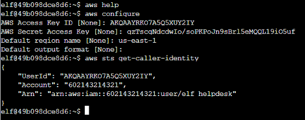

# AWS CLI Intro

### Challenge
:::info Challenge Text
*Difficulty:* ★✰✰✰✰

Try out some basic AWS command line skills in this terminal. Talk to Jill Underpole in the Cloud Ring for hints.
:::

### Answer

:::note Question 0
You may not know this, but AWS CLI help messages are very easy to access. First, try typing: ```aws help``` and when you're done, you can quit with ```q```
:::
<details>
<summary>Answer: <code>aws help</code></summary>
</details>

:::note Question 1
Configure the default aws cli credentials with the following: access key```AKQAAYRKO7A5Q5XUY2IY```secret key```qzTscgNdcdwIo/soPKPoJn9sBrl5eMQQL19iO5uf```region```us-east-1```
:::
<details>
<summary>Answer: <code>aws configure</code></summary>
we paste the credentials given in the question when prompted:


</details>


:::note Question 2
Please get your caller identity using the AWS command line.
:::
<details>
<summary>Answer: <code>aws sts get-caller-identity</code></summary>
This command checks the credentials we added in the previous step and returns the user id, account, and ARN for those credentials.



</details>