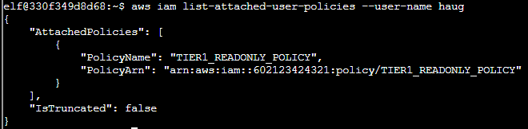
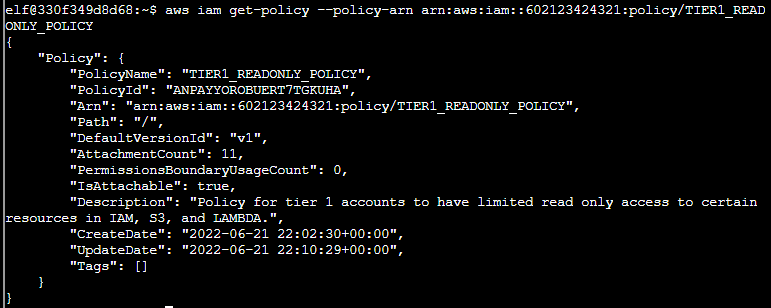
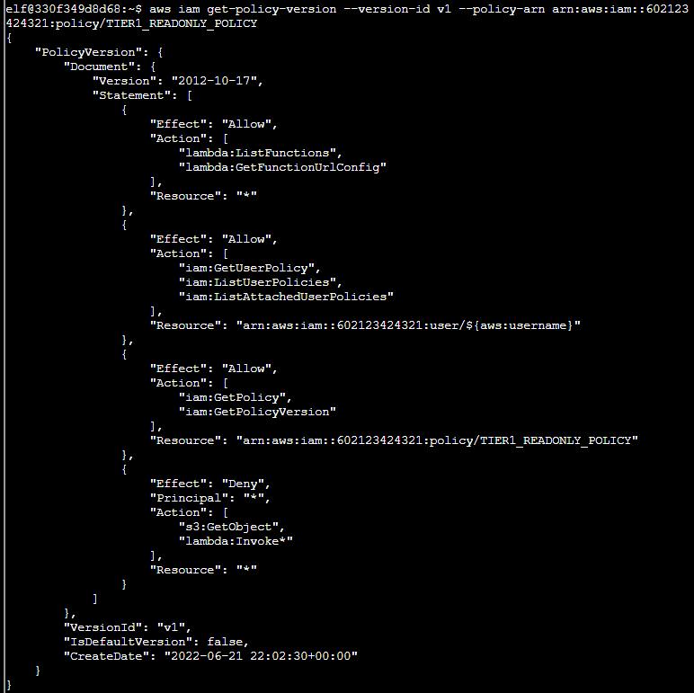
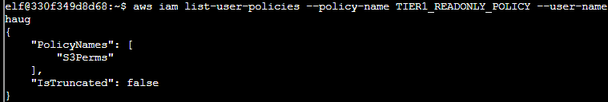
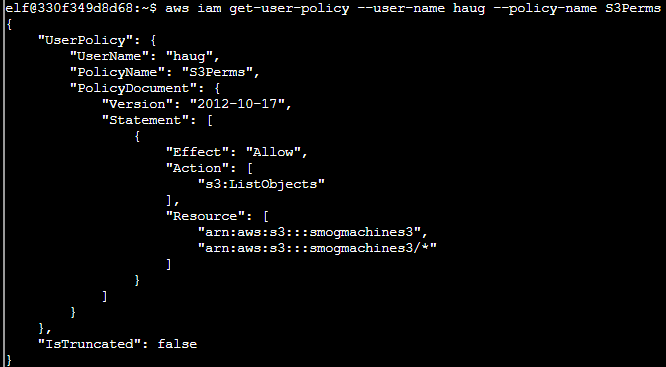
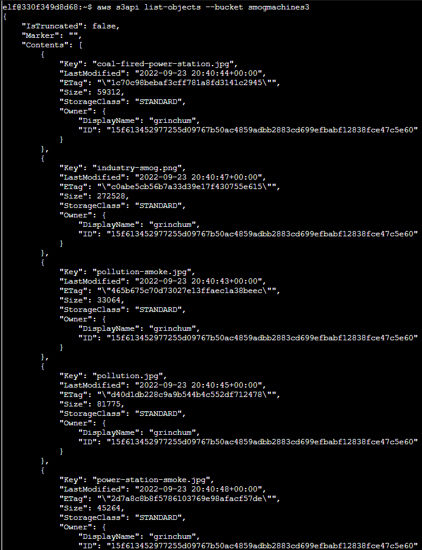
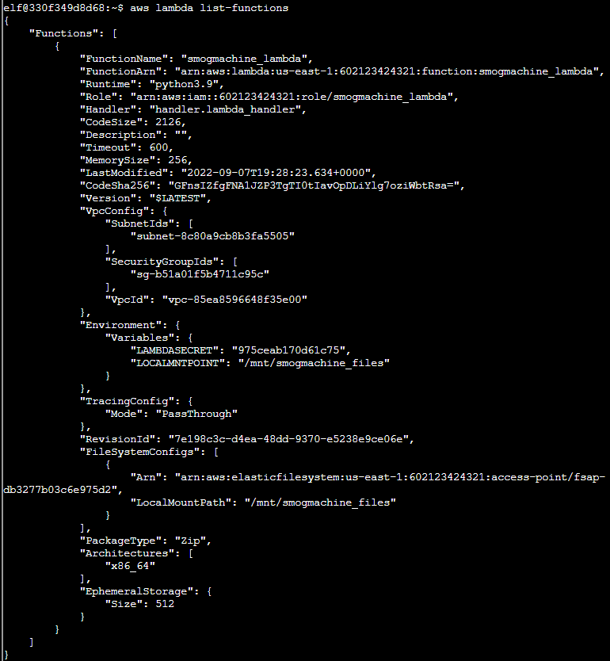
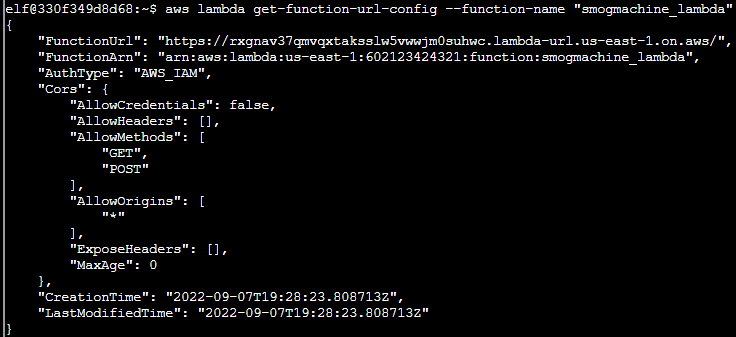

# Explitation via AWS CLI

### Challenge
:::info Challenge Text
*Difficulty:* ★★★✰✰

Flex some more advanced AWS CLI skills to escalate privileges! Help Gerty Snowburrow in the Cloud Ring to get hints for this challenge.
:::

### Answer

:::note Question 1
Managed (think: shared) policies can be attached to multiple users. Use the AWS CLI to find any policies attached to your user.
The aws iam command to list attached user policies can be found here:
https://awscli.amazonaws.com/v2/documentation/api/latest/reference/iam/index.html
Hint: it is NOT list-user-policies.
:::
<details>
<summary>Answer 1: <code>aws iam list-attached-user-policies --user-name haug</code></summary>



We get the response above listing the ```"PolicyArn": "arn:aws:iam::602123424321:policy/TIER1_READONLY_POLICY"```associated with our user ```haug```, which we can use to answer the next question.
</details>


:::note Question 2
Now, view or get the policy that is attached to your user.
The aws iam command to get a policy can be found here:
https://awscli.amazonaws.com/v2/documentation/api/latest/reference/iam/index.html
:::
<details>
<summary>Answer 2: <code>aws iam get-policy --policy-arn arn:aws:iam::602123424321:policy/TIER1_READONLY_POLICY</code></summary>



We get the response above listing the ```"DefaultVersionId": "v1"``` which we can use along with ```"PolicyArn": "arn:aws:iam::602123424321:policy/TIER1_READONLY_POLICY"``` to answer the next question.
</details>


:::note Question 3
Attached policies can have multiple versions. View the default version of this policy.
The aws iam command to get a policy version can be found here:
https://awscli.amazonaws.com/v2/documentation/api/latest/reference/iam/index.html
:::
<details>
<summary>Answer 3: <code>aws iam get-policy-version --version-id v1 --policy-arn arn:aws:iam::602123424321:policy/TIER1_READONLY_POLICY</code></summary>



We get the response above listing the privileges associated with version 1 of the policy associated with our user ```haug```
</details>


:::note Question 4
Inline policies are policies that are unique to a particular identity or resource. Use the AWS CLI to list the inline policies associated with your user. 
The aws iam command to list user policies can be found here:
https://awscli.amazonaws.com/v2/documentation/api/latest/reference/iam/index.html
Hint: it is NOT list-attached-user-policies.
:::
<details>
<summary>Answer 4: <code>aws iam list-user-policies --policy-name TIER1_READONLY_POLICY --user-name haug</code></summary>



We get the response above indicating that there is an in-line policy associated with our user ```haug``` and it is called ```S3Perms```. We can use this to answer the next question.
</details>


:::note Question 5
Now, use the AWS CLI to get the only inline policy for your user. 
The aws iam command to get a user policy can be found here:
https://awscli.amazonaws.com/v2/documentation/api/latest/reference/iam/index.html
:::
<details>
<summary>Answer 5: <code>aws iam get-user-policy --user-name haug --policy-name S3Perms</code></summary>



We get the response above naming the s3 Resources ```"arn:aws:s3:::smogmachines3"``` we have the ```s3:ListObjects``` privilege on. We can use this to answer the next question.
</details>


:::note Question 6
The inline user policy named S3Perms disclosed the name of an S3 bucket that you have permissions to list objects. 
List those objects! 
The aws s3api command to list objects in an s3 bucket can be found here:
https://awscli.amazonaws.com/v2/documentation/api/latest/reference/s3api/index.html
:::
<details>
<summary>Answer 6: <code>aws s3api list-objects --bucket smogmachines3</code></summary>



</details>


:::note Question 7
The attached user policy provided you several Lambda privileges. Use the AWS CLI to list Lambda functions.
The aws lambda command to list functions can be found here:
https://awscli.amazonaws.com/v2/documentation/api/latest/reference/lambda/index.html
:::
<details>
<summary>Answer 7: <code>aws lambda list-functions</code></summary>



We get the response above naming the lamda function. ```"FunctionName": "smogmachine_lambda"``` can be used to answer the next question.
</details>


:::note Question 8
The aws lambda command to get the function URL config can be found here:
https://awscli.amazonaws.com/v2/documentation/api/latest/reference/lambda/index.html
:::

<details>
<summary>Answer 8: <code>aws lambda get-function-url-config --function-name "smogmachine_lambda"</code></summary>


</details>

