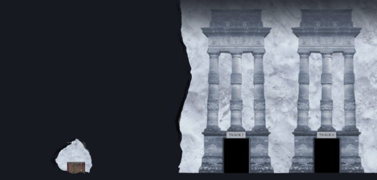
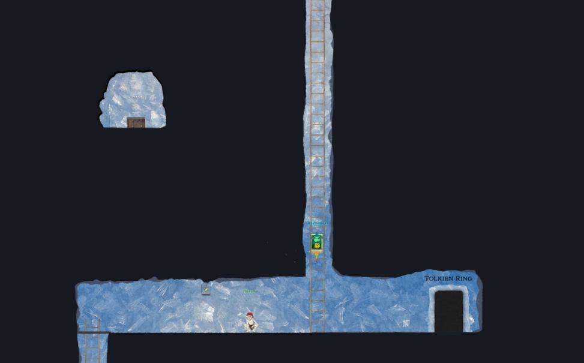
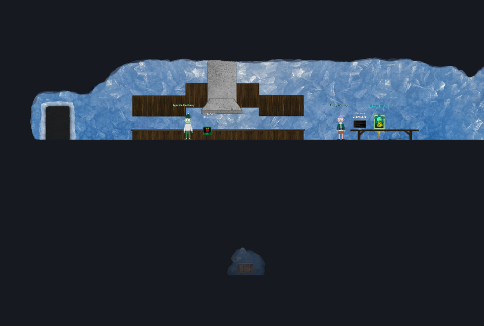
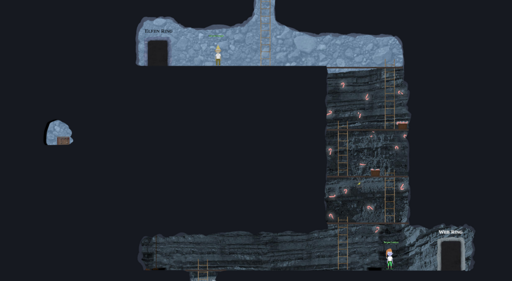
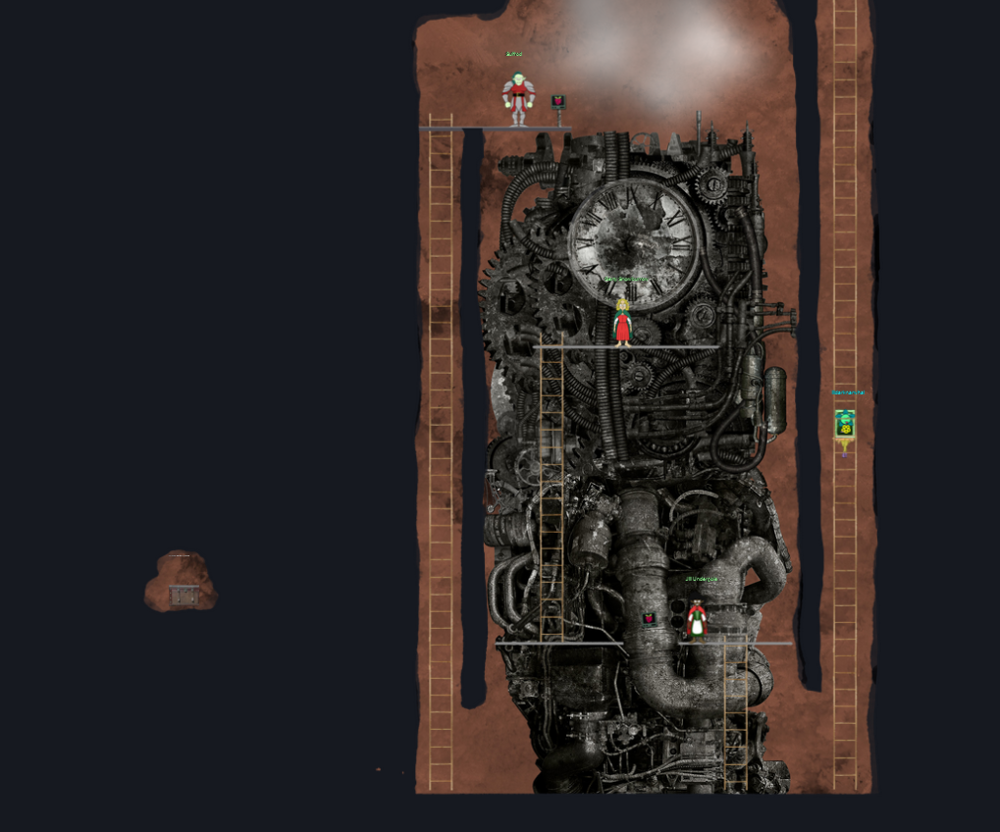
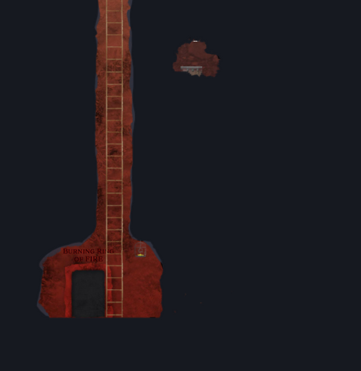

# Secrets

Thar be treasure in these parts!

### Treasure #1

location: <code>In the Hall of Talks past track 7</code>

From the track 7 door, push the <-- (left arrow) 7 times

### Treasure #2

location: <code>After the hall of talks before the Tolkin Ring entrance</code>

12 down (from the top of the ladder)

You should be about where the avatar in the screenshot is

then:
* 6 left
* 2 up
* 3 right
* 7 up
* 8 left
* 3 down
* 2 right

### Treasure #3

location: <code>In the Tolkin Ring</code>

There is a secret trap door next to the windows event logs terminal where the avatar in the screenshot is standing.

once at the trap door location then:

* 2 down
* 1 left
* 1 down
* 1 left
* 1 down
* 1 left
* 1 down
* 1 left
* 1 down
* 1 left
* 1 down
* 2 left

### Treasure #4

location: <code>Between the Elfen Ring and Web Ring</code>

At the Elfen Ring door:
* 5 down
* 6 left

OR

Go all the way to the left of the "Web Ring" Level:
* 8 up
* 6 left

### Treasure #5

location: <code>In the Cloud Ring</code>

In the cloud ring area go to the bottom of the ladder that is the furthest on the left

* 4 left
* 5 up
* 3 left

### Treasure #6

location: <code>Between the Cloud Ring and Burning Ring</code>

Next to the entrance of the burning ring from the bottom of the ladder 

* 13 Right
* 9 up
* 2 left
* 2 down
* 2 left
* 2 up
* 2 left
* 7 down
* 2 left
* 2 up
* 2 left
* 2 up
* 2 right
* 3 up
* 2 left

