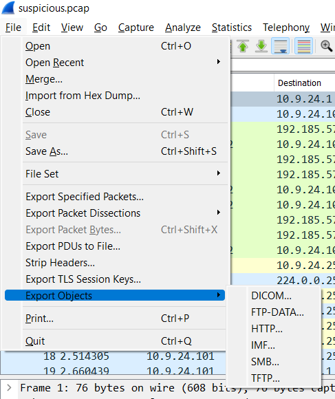
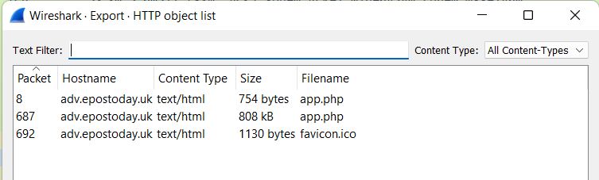
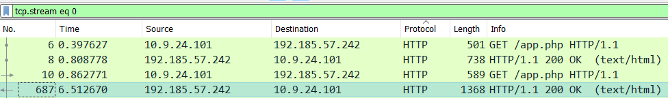

# Wireshark Practice
<!-- MDX imports -->
import Answer from '@site/src/components/Answer'
import CodeBlock from '@theme/CodeBlock';

<!-- Page content -->
Our first challenge is to help a hapless elf who seems to have clicked on a malicious link in their email. We're given a very sus PCAP file called ```suspicious.pcap```

:::note Question 1
There are objects in the PCAP file that can be exported by Wireshark and/or Tshark. What type of objects can be exported from this PCAP?
:::


:::note Question 2
What is the file name of the largest file we can export?
:::
<Answer answer="app.php">
Assets can be exported from Wireshark by clicking ```File -> Export Objects -> HTTP...```



Afterwards, the export dialogue opens:



Here, we can see that the largest file is the second in this list: **```app.php```**, coming in at 808kb.
</Answer>

:::note Question 3
What is the packet number that starts that app.php file?
:::
Thankfully, we can find the answer to this in the same dialogue as above. If we look at the far left column, we see that this file begins at packet number **```687```**.

:::note Question 4
What is the IP of the Apache server?
:::

<details>
<summary>Answer: <code>192.185.57.242</code></summary>
```Moving on, we’re asked to find the source address of the Apache server which served this file. We can find this by clicking on the app.php line of the export dialogue (which will select packet 687 for us) and then going back to the main Wireshark window.```



Looking at this image, we see a source IP address of ```192.185.57.242``` and a destination address of ```10.9.24.101```, which we can note for later. Since this packet was served in response to an HTTP request, the Apache server is the IP in the source column of this packet: **```192.185.57.242```**.
</details>

:::note Question 5
What file is saved to the infected host?
:::
At this point, it’s news to us that a file had been saved to a host at all, but thanks, terminal. Since we’d been told that this started when the elf we’re helping clicked a link in their email, it seems likely that the file was delivered over HTTP. Since we’re already inspecting packet 687, we can right click it in the GUI and select Follow -> HTTP Stream to view the actual content(s) of app.php.

A quick analysis of the embedded JavaScript on this page should hopefully make more sense of what happened. The first retrieval of app.php merely sets two cookies and then reloads the page (comments are ours):

```html
<script>
	let d = -new Date().getTimezoneOffset(); // Time zone offset (from GMT) of the local time zone
	let n = Intl.DateTimeFormat().resolvedOptions().timeZone; // Human-readable time zone name

    ...

	if (!get_cookie('d') && !get_cookie('n')) {
		set_cookie('d', d, 2); // Set cookie "d" to the time zone offset with an expiration of 2 minutes
		set_cookie('n', n, 2); // Set cookie "n" to the time zone name with an expiration of 2 minutes
		document . location . reload(); // Reload the window to retrieve app.php again
	}
</script>
```

As annotated above, the contents of the cookies ```d``` and ```n``` are the target machine’s time zone offset and time zone name, respectively. This information could have been used by evildoers to target North Pole residents specifically, although we don’t have a way to be sure of this without looking at the PHP source code. The second load of the page contains some much more interesting snippets (here some comments are ours, but some existed in the source already):

```html
<script>
function saveAs(blob, fileName) {
let url = window.URL.createObjectURL(blob); // Creates a URL for the "blob" argument

let anchorElem = document.createElement('a'); // Creates an "a" element in the HTML document named anchorElem
anchorElem.style = 'display: none'; // Sets anchorElem to not be rendered in a browser window
anchorElem.href = url; // Sets the href of the document to the URL that was obtained earlier
anchorElem.download = fileName; // Specifies the file name should the user click on this element

document.body.appendChild(anchorElem);
anchorElem.click(); // Forcibly click anchorElem, downloading the contents of "blob"

document.body.removeChild(anchorElem); // Remove the element from the page after the file has been downloaded
...
}

(function() {
    let byteCharacters = ("...") // Obscenely long string of characters. This is an ASCII representation of the payload that the attacker wants us to pwn us with
    let byteNumbers = new Array(byteCharacters.length);
for (let i = 0; i < byteCharacters.length; i++) { // This for loop serves to copy the encoded byteCharacters string into the byteNumbers array created previously
    byteNumbers[i] = byteCharacters.charCodeAt(i);
}
let byteArray = new Uint8Array(byteNumbers); // Here, the byteNumbers array is used to make a byte array, which is actually usable as a downloadable octet stream

// now that we have the byte array, construct the blob from it
let blob1 = new Blob([byteArray], {type: 'application/octet-stream'});

saveAs(blob1, 'Ref_Sept24-2020.zip'); // Using the saveAs function defined above, the attacker saves this blob as "Ref_Sept24-2020.zip"
})();
</script>
```

To put it shortly, the majority of this response’s size is made up of an extremely large string named “byteCharacters”. This string is converted to a byte array and then forcibly downloaded to our very sad elf’s computer. In the final line, we can see that this file is downloaded as **```Ref_Sept24-2020.zip```**.

:::note Question 6
Attackers used bad TLS certificates in this traffic. Which countries were they registered to?
:::

:::info Answer: ```Israel, South Sudan```
Looking through the certificates in the resultant traffic reveals several certificates from Microsoft and Baltimore CyberTrust Root, all of which appear to be legitimate at a glance. Two certificates however are signed by the common names of heardbellith.Icanwepeh.nagoya and psprponounst.aquarelle both of which looked like absolute gibberish. At this point, we decided to Google these names to make sure that wasn’t due to us being uncultured Americans, but thankfully, they do seem to be gibberish in every language. The issuers of these certificates have the country codes of IL and SS, respectively, and a quick Google of these codes showed that our answer should be Israel, South Sudan.
:::
