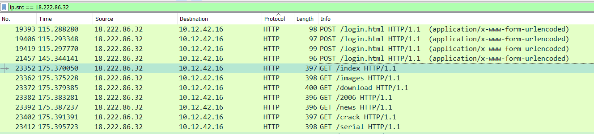
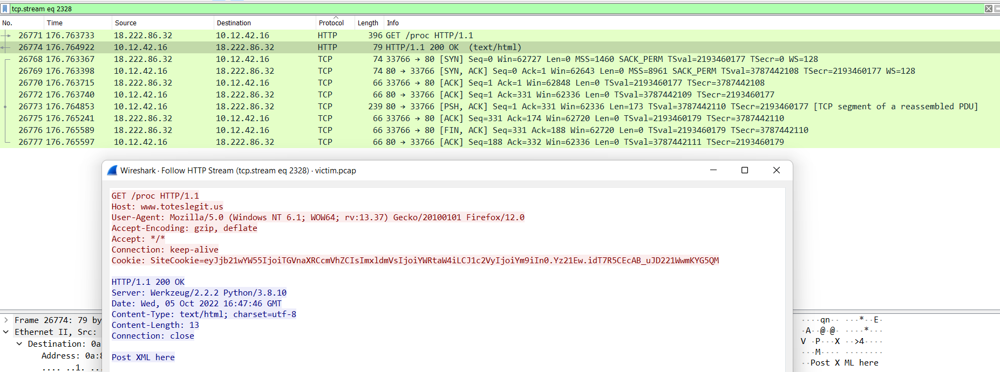

# 404 FTW

### Background
Still using the artifact PCAP, we're now asked to look for the first successful forced browsing attempt that the attacker made.

### Challenge
:::info Challenge Text
*Difficulty:* ★✰✰✰✰

The next attack is forced browsing where the naughty one is guessing URLs. What's the first successful URL path in this attack?
:::

### Answer

Still filtering on the source IP being the "Naughty IP", at the end of the cred mining attack we see a series of GET requests with different target url directories. The first of these is for the path ```/index```.



However, since we need to see the responses too, we'll remove the filter and look for the first packet after the forced browsing attack starts (packet 23352) that gets a response other than 404 (not found). Scrolling down, we can find the first 200 (success) response code from the server at packet 26774. Right clicking on it, we can once again right click on this packet and select ```Follow -> HTTP Stream```:



We can see from this request that the first successful endpoint was **```/proc```**.