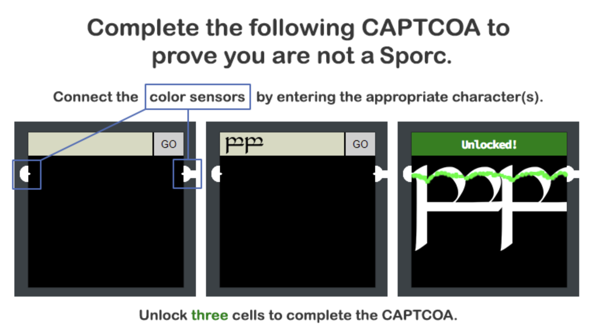

# Open Boria Mine Door

import CodeBlock from '@theme/CodeBlock';
import Admonition from '@theme/Admonition';

### Background
The Boria Mine door is standing firmly between us and the final trial to retrieve the Web Ring. The lock on this door poses itself as an elven "CAPTCOA" - a device used to prove to the door that we're not a nasty Sporc. Let's start by taking a look at the explanation:



...Okay 🤔. Well, we're going to have a hard time proving our elvishness without being able to input elf characters. And that's not for lack of trying; we started this challenge off by trying to submit [Tengwar Unicode characters](https://en.wikipedia.org/wiki/Tengwar#Unicode) to no avail (that would have been pretty cool though, huh?). Looks like we're going to have to figure something else out.

### PIN 1
<details>
<summary><b>Answer:</b>
<div style={{display:'grid', gridTemplateColumns:'70% 30%', gridGap:'20px'}}>
    <div>
        <CodeBlock language="html">&lt;script&gt;document.body.style.backgroundColor = "white"&lt;/script&gt;</CodeBlock>
    </div>
    <div>
        
    </div>
</div>
</summary>
<p>
The answer we've listed here wasn't our first working answer for this challenge. That said, it illustrates the true theme of this challenge: injections! The site that renders the text for checking the input CAPTCOA doesn't do a good job of making sure that we're only submitting Elvish characters and will, in most of these PINs, render whatever we ask it to.

The answer above injects a script tag that modifies the `body` element's background (i.e. the background of the whole page) to `white` - the color we need to connect our nodes with.

---
The first answer we tried that worked used [ASCII block elements](https://en.wikipedia.org/wiki/Block_Elements) to draw a line that connected the two nodes:
```
█████████████
```

After bypassing this lock, we also found the following comment in the page's source code, which also works:
```
<!--@&@&&W&&W&&&&-->
```
</p>
</details>


### PIN 2
<details>
<summary><b>Answer:</b>
<div style={{display:'grid', gridTemplateColumns:'70% 30%', gridGap:'20px'}}>
    <div>
        <CodeBlock language="html">&lt;div style="background:white;height:300px;width:300px"&gt;&lt;/div&gt;</CodeBlock>
    </div>
    <div>
        
    </div>
</div>
</summary>
<p>
As effective as our strategy was for part one, it seems like this PIN filters out injected scripts. However, this PIN does let us inject other random HTML elements. Because of this, we simply inject a div with a style that makes it completely white and large enough to span the full length and width of the PIN's checked area, easily bridging the two nodes.
</p>
</details>

### PIN 3
<details>
<summary><b>Answer:</b>
<div style={{display:'grid', gridTemplateColumns:'70% 30%', gridGap:'20px'}}>
    <div>
        <CodeBlock language="html">&lt;script&gt;document.body.style.backgroundColor = "blue"&lt;/script&gt;</CodeBlock>
    </div>
    <div>
        
    </div>
</div>
</summary>
<p>
This answer is the same as the first part, we just set the background to blue this time.
</p>
</details>

### PIN 4
<details>
<summary><b>Answer:</b>
<div style={{display:'grid', gridTemplateColumns:'70% 30%', gridGap:'20px'}}>
    <div>
        <CodeBlock language="html">&lt;"&gt;&lt;script&gt;document.body.style.backgroundColor = "blue"; let whiteDiv = document.createElement("div"); whiteDiv.style.height = "100px"; whiteDiv.style.backgroundColor = "white";document.body.appendChild(whiteDiv);&lt;/script&gt;</CodeBlock>
    </div>
    <div>
        
    </div>
</div>
</summary>
<p>
Viewing this PIN's source, we can see that inputs sent to it are filtered through a simple sanitization function:

```js
    const sanitizeInput = () => {
        const input = document.querySelector('.inputTxt');
        const content = input.value;
        input.value = content
            .replace(/"/, '')
            .replace(/'/, '')
            .replace(/</, '')
            .replace(/>/, '');
    }
```

This function uses JavaScript regular expressions (the first arguments to the ```replace``` method, denoted by characters surrounded by forward slashes) to remove potentially nasty characters from the input. However, since these regex are not followed by the ```g``` character (to do a *global* match), each replacement will only be performed at most one time on the input string. So to bypass this PIN, we can do the following:

1. Stack the characters &lt;, ", and "&gt; at the start of the string to bypass the sanitization
1. Set the full document's background color to "blue"
1. Construct a new element - ```whiteDiv```
1. Make that div live up to its name by styling it with a white background and give it a height so it will render
1. Finally, we append the div to the document's body in order to actually render it

</p>
</details>

### PIN 5
<details>
<summary><b>Answer:</b>
<div style={{display:'grid', gridTemplateColumns:'70% 30%', gridGap:'20px'}}>
    <div>
        <CodeBlock language="html">&lt;script&gt;document.querySelector("body").style.backgroundColor = "red"; let blueDiv = document.createElement("div"); blueDiv.style.height = "100px"; blueDiv.style.width = "200px"; blueDiv.style.backgroundColor = "blue"; blueDiv.style.left = "25px"; blueDiv.style.top = "100px"; blueDiv.style.position = "absolute";  document.body.appendChild(blueDiv);&lt;/script&gt;</CodeBlock>
        <Admonition type="note">
        <p>
            This answer has to be submitted through Burp due to the JavaScript filtering that gets applied to input before a request is sent to the server.
        </p>
        </Admonition>
    </div>
    <div>
        
    </div>
</div>
</summary>
<p>

This PIN has nearly the same sanitization function as PIN 4, but this time the regex replacements are global, which makes script tag injection more difficult. However, since the sanitization is done through JavaScript in a browser window, we can use a tool like Burp to catch the web request in flight and simply paste the answer above in to bypass filtering altogether! The HTML "art" is also similar to PIN 4, although we do move the div's position with the ```position``` and ```left``` style directives.

</p>
</details>

### PIN 6
<details>
<summary>
    <b>Answer:</b>
    <div style={{display:'grid', gridTemplateColumns:'70% 30%', gridGap:'20px'}}>
        <div>
            <CodeBlock language="html">
                &lt;svg width="200" height="180" xmlns="http://www.w3.org/2000/svg"&gt;
                &lt;g id="Layer_1"&gt;
                &lt;title&gt;Layer 1&lt;/title>
                &lt;rect stroke="null" id="svg_5" height="81.13199" width="215.47148" y="-2.73576" x="-7.54706" fill="#00ff00"/&gt;
                &lt;rect id="svg_4" height="115.09422" width="243.77334" y="67.07549" x="-28.30176" stroke="null" fill="#ff0000"/&gt;
                &lt;path stroke="null" id="svg_3" d="m-1.50933,108.96224l166.79228,0l0,72.0754l-166.79228,0l0,-72.0754z" opacity="undefined" fill="#0000ff"/&gt;
                &lt;/g&gt;
                &lt;/svg&gt;
            </CodeBlock>
        </div>
    <div>
        
    </div>
</div>
</summary>
<p>
We attempted a few HTML and plain JavaScript injections into this PIN that were unsuccessful. Either we were doing it wrong or this PIN actually does sanitize both of them. Looking at Kringlecon's Discord server provided us with a hint that reframed the rest of the challenge. As it turns out, most of the PINs will accept and render SVG input!

At the risk of getting too deep in the weeds, SVG is a graphics format which stores data in XML. Since what is stored is essentially instructions on how to produce the encoded image, this format is useful for images which need to be scaled up and down without loss of fidelity.

Rather than construct the SVG by hand, we opted to open an online SVG editor and set the canvas size to the size of the PIN's iframe: ```200 * 180```

<div style={{textAlign:'center'}}>
    
</div>


Once the image was created, all that remained was saving it locally, `cat`-ing it to retrieve the XML content in the answer box above, and then pasting it into the PIN's input box to win!
</p>
</details>

---

### Aftermath

Once we've sucessfully completed at least three of these PINs, the Boria Mine door opens and we are allowed to face our next challenge!


