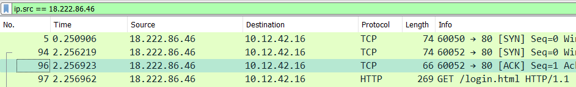
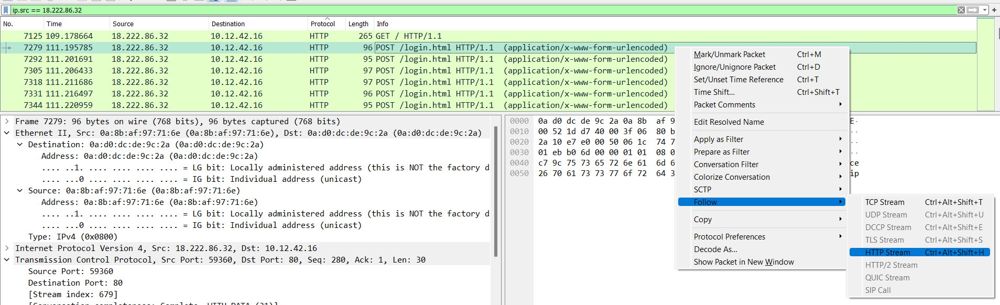
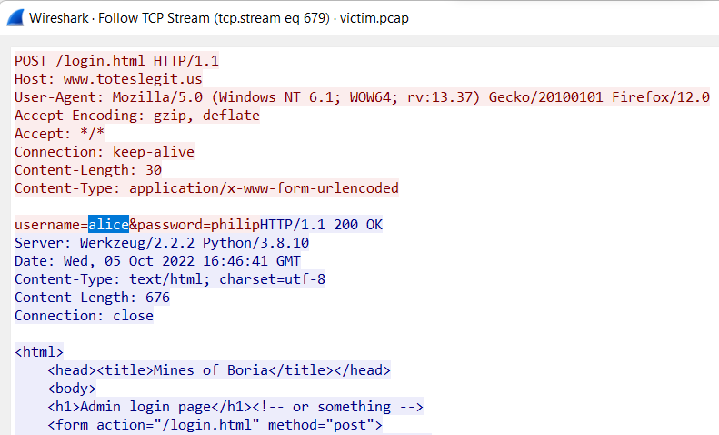

# Credential Mining

### Background
Using the same packet capture as before, we're told that the first attack attempted by the naughty IP was a brute force login and that we need to find the first username they attempted.

### Challenge
:::info Challenge Text
*Difficulty:* ★✰✰✰✰

The first attack is a brute force login. What's the first username tried?
:::

### Answer

Since we already know the IP address of the "Naughty IP"/source of the attack, we can start by filtering for all of the packets that originated there with the following Wireshark filter:

```
ip.src == 18.222.86.32
```



To submit a login request, we know the attacker must have sent a POST request, so we can find the first POST request we see from the naughty IP address (at packet number 7279), right click it, click ```Follow```, and then ```HTTP Stream```. 



This will bring up the text of the HTTP content sent to and from this IP in a separate dialogue:



Looking at this request, we can see that the attacker's first attempted username was **```alice```**.
