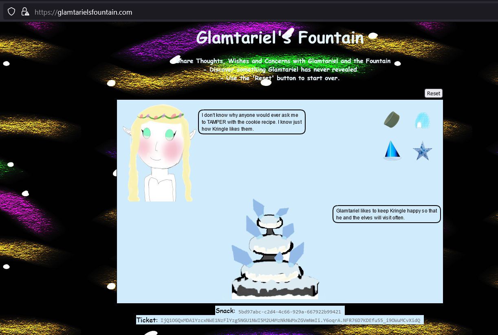

# Glamtariel's Fountain

### Background

Passing through the Boria Mine door, we're brought face to face with [Glamtariel and her sentient fountain](https://glamtarielsfountain.com). Our challenge is to discover something that Glamtariel has never revealed. Is she holding the Web Ring that we're seeking?

### Challenge
:::info Challenge Text
*Difficulty:* ★★★★★

Stare into Glamtariel's fountain and see if you can find the ring! What is the filename of the ring she presents you? Talk to Hal Tandybuck in the Web Ring for hints.
:::

### Answer

#### Hints from Glamtariel

According to Hal Tandybuck, Glamtariel will provide us with  hints by (somehow) speaking to us in upper case letters. During our time speaking to her, she gives us the following hints: ```TAMPER, PATH, TYPE, RINGLIST, SIMPLE, APP```


#### Solution

There are three phases to our interaction with Glamtariel, broken up by the objects that we are able to offer her. During all of the phases, by dropping objects on either the fountain or Glamtariel, they will each reveal their mundane thoughts to us along with a few s3cr3ts.


By giving Glamtariel and the fountain both the elf and santa objects, we can move on to phase two:



Next, by giving the fountain and Glamtariel all of these objects haphazardly (and clicking away a spooky eye along the way), we can advance to the final phase:


Now that we're here, we're able to coax secrets out of Glamtariel. Presenting her with the grey ring has her mention a **RINGLIST** that she makes us promise not to tell anyone about. Dragging the red ring to the fountain makes it mention that Glamtariel can speak in another **TYPE** of language. Unfortunately, we've now exhausted all of the useful information either party will give us through a browser. At this point, we decided to try asking in a different way by taking a peek at the web traffic that we were sending Glamtariel:


It looks like the data is sent in a simple JSON format. Since ```reqType``` is one of the parameters, Glamtariel's hint of "**TYPE**", and the [XXE](https://owasp.org/www-community/vulnerabilities/XML_External_Entity_(XXE)_Processing) hint we received from Hal Tandybuck, implies that we should try to format our request as XML and see what happens:


This request works! Glamtariel is clearly well-learned if she can speak such an arcane language. Now that we can ask in XML, we'll try to find that ringlist file that Glamtariel mentioned earlier.

Trying a few strings in the ```imgDrop``` field such as ```ringlist```, ```ringlist.xml```, and ```RINGLIST``` doesn't seem to have any effect - neither the fountain nor Glamtariel have any idea what we're talking about. At this point, we'll try an XXE for ```ringlist.txt``` (```.txt``` since the fountain hints that the list is stored in a **SIMPLE** format). We send the following as our request (also using the ```/app``` directory since we need to browse from the filesystem's root and **APP** was provided as a hint earlier):

```xml
<?xml version="1.0" encoding"UTF-8" ?>
<!DOCTYPE replace [<!ENTITY xxe SYSTEM
"file:///app/static/images/ringlist.txt" >]>
    <root>
        <imgDrop>&xxe;</imgDrop>
        <reqType>xml</reqType>
        <who>princess</who>
    </root>
```

And this works! In Glamtariel's response, we're given a reference to an image at ```static/images/pholder-morethantopsupersecret63842.png```. Let's try going there and seeing what it is:


The image shows us a folder labeled "x_phial_pholder_2022" which seems to contain two other ring files. Assuming this is indicative of the files/folder structure stored on this webserver, let's try our XXE again inside this folder with ```bluering.txt```:


That's interesting: it looks like this is the same speech Glamtariel gives us when we manually drop this ring on her in a browser. Although we didn't see it in the folder, one of the rings that Glamtariel presented us with earlier was silver. Let's try that next:


When we ask about the silver ring, we're also provided with an image of Glamtariel's red ring, which has seemingly been defiled. Looking closer at it reveals an etched secret:


To prevent you from turning your head upside-down, the text on the red ring is ```goldring_to_be_deleted.txt```. With the end almost in sight, we ask Glamtariel about the golden ring:

```xml
<?xml version="1.0" encoding="UTF-8" ?>
<!DOCTYPE replace [<!ENTITY xxe SYSTEM "file:///app/static/images/x_phial_pholder_2022/goldring_to_be_deleted.txt" >]>
    <root>
      <imgDrop>&xxe;</imgDrop>
      <who>princess</who>
      <reqType>xml</reqType>
    </root>
```

Unfortunately, she rebuffs us and tells us that we've sent a "bold **REQ**uest", and mentions that she would only use a special **TYPE** of language to talk about such secrets. For our last request, we perform the XXE in the ```reqType``` field:

```xml
<?xml version="1.0" encoding="UTF-8" ?>
<!DOCTYPE replace [<!ENTITY xxe SYSTEM "file:///app/static/images/x_phial_pholder_2022/goldring_to_be_deleted.txt" >]>
    <root>
      <imgDrop>img1</imgDrop>
      <who>princess</who>
      <reqType>&xxe;</reqType>
    </root>
```


Finally trusted by Glamtariel, we walk away victorious with a golden ring filename of **```goldring-morethansupertopsecret76394734.png```**!
