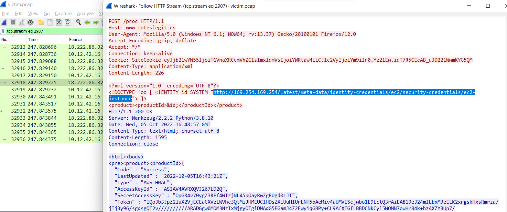

# IMDS, XXE, and other Abbreviations

### Background
Still analyzing the suspicious PCAP, we're reaching the endgame of the attacker: exfiltrating some information from [IMDS](https://docs.aws.amazon.com/AWSEC2/latest/UserGuide/instancedata-data-retrieval.html).

### Challenge

:::info Question
The last step in this attack was to use XXE to get secret keys from the IMDS service. What URL did the attacker force the server to fetch?
:::

We know two things that should help us with this challenge:

1. The attacker used information gathered in the previous "forced browsing" attack (ie /proc directory will respond with XML related to/requested in the previous POST request). 

1. IMDS attacks force a request to a non-routable/internal IP address that is always http://169.254.169.254/* 

To solve this, we'll once again turn to the suspicious PCAP. Once we find a packet with 169.254.169.254 in data section of a POST request we can click follow stream and look at the last packet sent before AWS credentials are returned.



The full URL requested was **```http://169.254.169.254/latest/meta-data/identity-credentials/ec2/security-credentials/ec2-instance```**.
