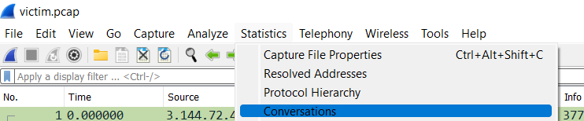
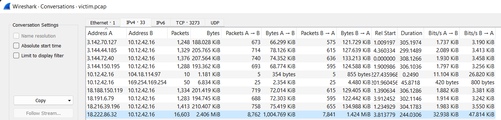

# Naughty IP

### Background
We've talked to Alabaster Snowball, an elf helping the dwarves in the Boria mines and he's given us an artifact (another PCAP file) that we'll use for the next few challenges. He thinks that it contains evidence of some naughty activity. We were both eager for the opportunity to add another name to this year's naughty list, so we opened Wireshark and got to work.

### Challenge
:::info Question
Use the artifacts from Alabaster Snowball to analyze this attack on the Boria mines. Most of the traffic to this site is nice, but one IP address is being naughty! Which is it? Visit Sparkle Redberry in the Tolkien Ring for hints.
:::

Once we have Wireshark and the artifact packet capture opened, our goal is to find one IP address in particular which seems naughty. Alabaster has also given us a hint to look into Wireshark's *Statistics* menu, so we'll take him up on that. Rather than looking through each packet, we can get a summary of the traffic in this PCAP by clicking ```Statistics -> Conversations``` in the top bar.



When we click this, the following dialogue opens:



This dialogue shows a list of hosts featured in the PCAP, as well as the number of packets they have sent and received, the total size of these packets, etc. Among these, the last address in the list above has sent and received significantly more packets than the rest at 16,603 in a 244 second window! This warrants further investigation, but our answer to Alabaster is **```18.222.86.32```**.